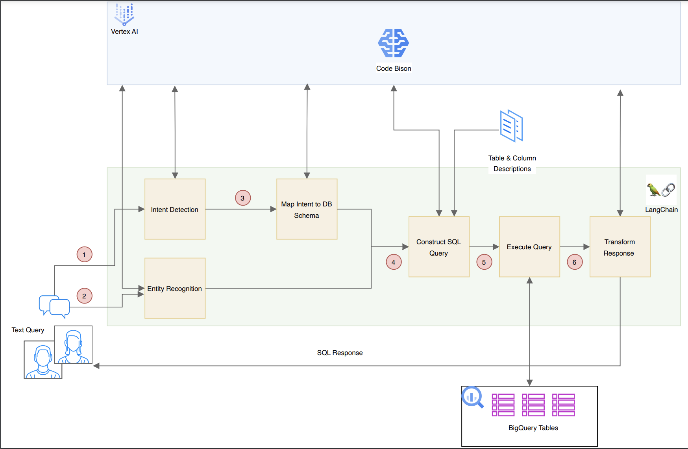
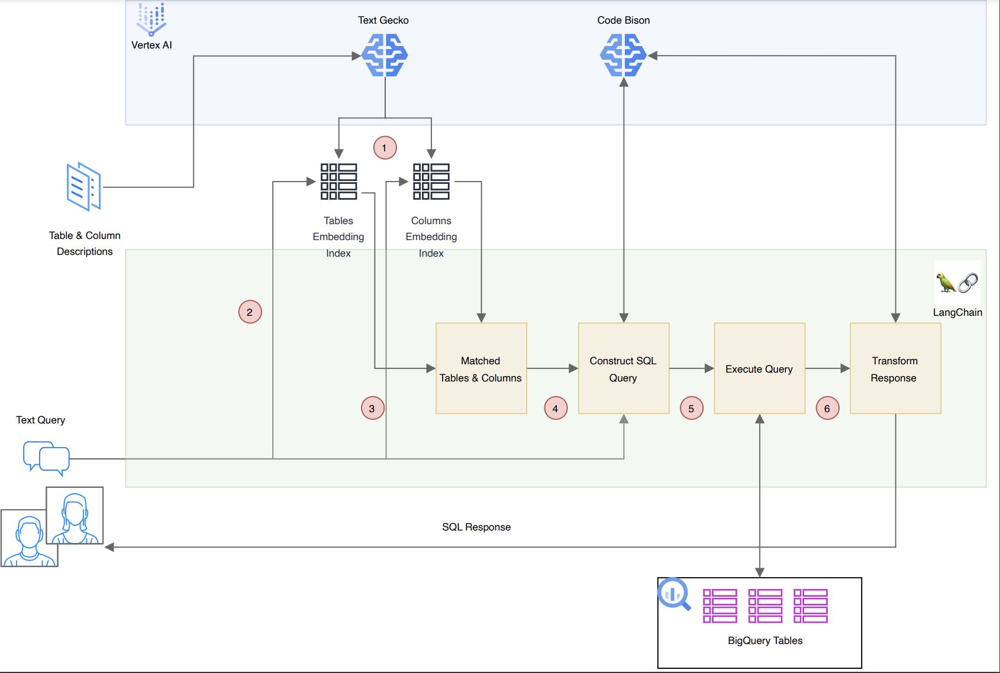
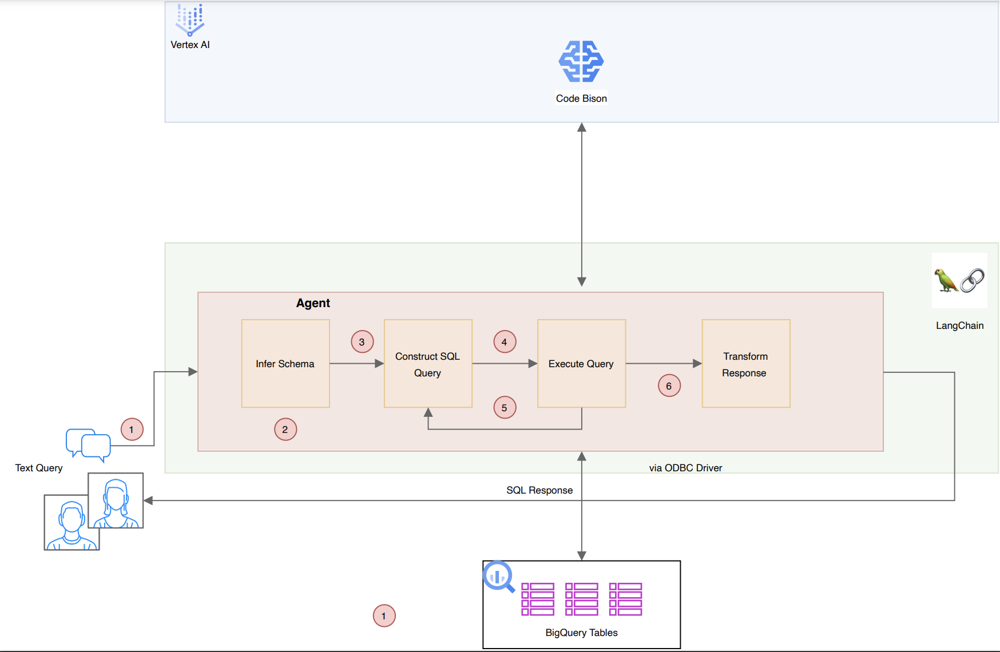
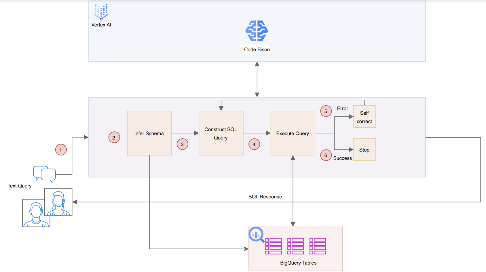
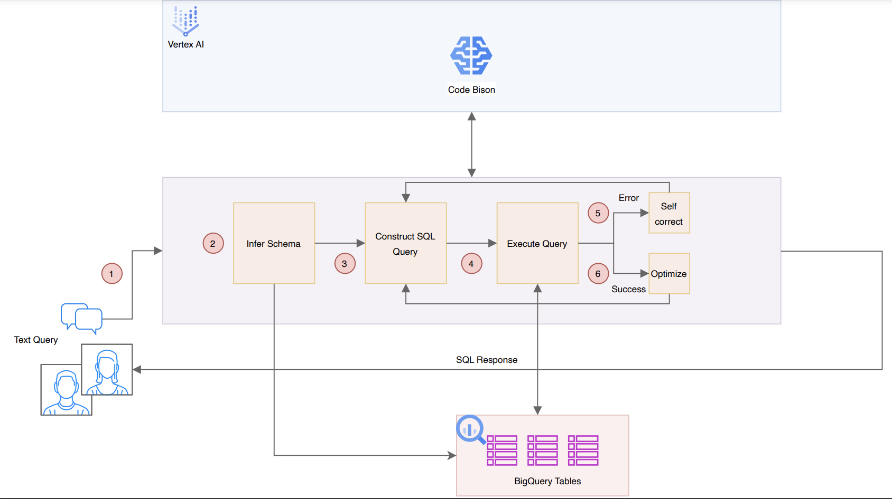

# LLM-Text-to-SQL-Architectures

A comprehensive guide and implementation of architectural patterns that utilize Large Language Models (LLMs) for the efficient generation of SQL from natural language text.

For comprehensive details on the architectural patterns mentioned below, please refer to the accompanying article on Medium. This piece delves into the utilization of LLMS for enhanced BigQuery interactions. You can access the article via this link.

[Architectural Patterns for Text-to-SQL: Leveraging LLMs for Enhanced BigQuery Interactions](https://medium.com/@shankar.arunp/architectural-patterns-for-text-to-sql-leveraging-llms-for-enhanced-bigquery-interactions-59756a749e15?source=friends_link&sk=22b06c1644e968023b24db79f2995588)

## Table of Contents

- [Introduction](#introduction)
- [Architectural Patterns](#architectural-patterns)
  - [Pattern I](#pattern-i)
  - [Pattern II](#pattern-ii)
  - [Pattern III](#pattern-iii)
  - [Pattern IV](#pattern-iv)
  - [Pattern V](#pattern-v)
- [Getting Started](#getting-started)
- [Challenges and Limitations](#challenges-and-limitations) (In Progress)
- [Contributing](#contributing)
- [License](#license)

## Introduction 📘

This repository offers an in-depth exploration into Text-to-SQL conversion, emphasizing the role of LLMs in enhancing the SQL generation process. With the advent of LLMs, there is a promising opportunity to streamline the translation of natural language to SQL. We explore various architectural patterns that leverage the capabilities of LLMs in this exciting field.

## Architectural Patterns 🏗️

### Pattern I: Intent Detection and Entity Recognition with Text-to-SQL
Utilizing LLMs to identify intent, extract entities, and subsequently generate SQL.

<div align="center">

</div>

<div align="center">
  Click on image to enlarge
</div>

### Pattern II: LLM Flow with Retrieval-Augmented Generation (RAG)
Incorporating Retriever-Augmented Generation (RAG) with table and column metadata to pinpoint relevant database schema elements, allowing LLMs to formulate queries based on natural language questions.

<div align="center">

</div>

<div align="center">
  Click on image to enlarge
</div>

### Pattern III: Using SQL Agents
Adopting an autonomous agent-based approach where a BigQuery SQL agent, equipped with an ODBC connection, iteratively attempts and refines SQL queries with minimal external guidance.

<div align="center">

</div>

<div align="center">
  Click on image to enlarge
</div>

### Pattern IV: Direct Schema Inference with Self-Correction
Implementing a self-correcting mechanism where the LLM receives direct schema input, generates an SQL query, and upon execution failure, uses the error feedback to self-correct and retry until successful. This pattern also explores using the Code-Chat Bison model to potentially reduce costs and improve latency.

<div align="center">

</div>

<div align="center">
  Click on image to enlarge
</div>

### Pattern V: Direct Schema Inference, Self-Correction & Optimization
Similar to Pattern IV but employs a stochastic approach with a temperature setting of 1. It runs multiple trials and selects the query that executes the fastest.

<div align="center">

</div>

<div align="center">
  Click on image to enlarge
</div>

## Getting Started 🚀

1. **Clone the Repository**:

   ```bash
   git clone https://github.com/your_username/LLM-Text-to-SQL-Architectures.git
   ```

2. Navigate to the directory:

   ```bash
   cd LLM-Text-to-SQL-Architectures
   ```

3. **Set up a virtual environment**:

   ```bash
   python3 -m venv .venv
   source .venv/bin/activate
   ```

4. **Install dependencies**:

   ```bash
   pip install -r requirements.txt
   ```

Follow the individual pattern READMEs for detailed setup and usage instructions.

## Challenges and Limitations ⚠️

This section discusses the potential pitfalls, challenges, and areas for improvement in the application of LLMs for Text-to-SQL conversion. 

See Medium article: [Architectural Patterns for Text-to-SQL: Leveraging LLMs for Enhanced BigQuery Interactions](https://medium.com/@shankar.arunp/architectural-patterns-for-text-to-sql-leveraging-llms-for-enhanced-bigquery-interactions-59756a749e15?source=friends_link&sk=22b06c1644e968023b24db79f2995588)

## Contributing 🤝

Contributions are what make the open-source community such an amazing place to learn, inspire, and create. Any contributions you make are **greatly appreciated**. Check out CONTRIBUTING.md for guidelines on how to submit pull requests.

## License 📄

This project is licensed under the MIT License - see the [LICENSE.md](LICENSE.md) file for details.